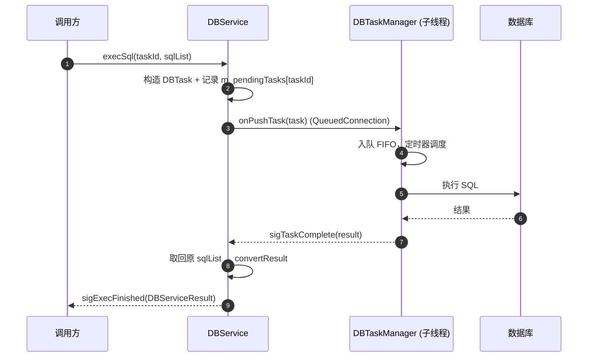
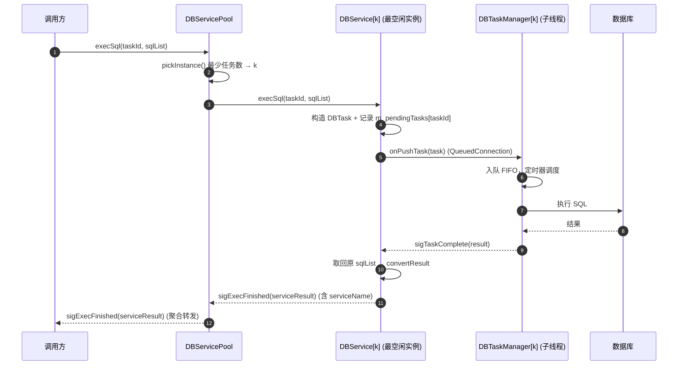

# DBServicePool策略优势

> **Workspace:** e:\dev\Project\vibeCoding\utils

---

**User**

DBServicePool相当于与他们自己去创建DBService，然后给策略有什么好处

**Assistant**

这个问题问到点子上了。从结果上看，Pool 内部确实就是"替调用方创建了 N 个 DBService"，核心差别在于**这些编排逻辑由谁写、写几遍、改起来要不要动调用方代码**。

## Pool 相对于"调用方自己创建 N 个 DBService"的好处

**1. 负载均衡逻辑收口（最核心）**

调用方自己分发，一般只能做简单轮询。而 [DBServicePool设计.md](file:///e:/dev/Project/vibeCoding/utils/DBService/docs/progress_docs/DBServicePool设计.md#L79-L93) 里的"最少任务数"策略依赖 `pendingCount()` 实时队列深度：

- 这个查询方法是 Pool 为了均衡才加的，调用方若自己实现，得先知道每个 DBService 的内部状态；
- 均衡策略写一次、改一次，所有使用方自动受益，而不是每个调用方各写一套（且容易写错）。

**2. 信号聚合，调用方只见一个对象**

N 个实例就有 N 套 `sigExecFinished`。自己管理时调用方要：

- 连接 N 套信号；
- 靠 serviceName 自己区分结果归属；
- 析构时手动处理每个实例的线程/连接清理。

Pool 把这些统一成 [3 个聚合信号](file:///e:/dev/Project/vibeCoding/utils/DBService/docs/progress_docs/DBServicePool设计.md#L62-L65)，调用方代码量和用单个 DBService 一样。

**3. 扩容零改动**

并发从 4 升到 8，只改 `DBServicePool(cfg, 8)` 一个参数，分发/聚合/生命周期逻辑都不用碰。自己管理则要新增实例、连新信号、改分发逻辑。

**4. 生命周期和配置的样板代码消除**

`init()`/`start()` 逐实例调用、配置克隆、实例命名（`pool_0`…）这些重复样板被封装进 Pool，析构时实例随 QObject 父子关系自动回收——少了这类代码，也就少了"某个实例忘了 start"这类 bug 的土壤。

## 需要注意的边界

- 如果调用方**只开 1 个实例**，Pool 没有意义，直接用 DBService 即可；
- 如果调用方有**差异化配置**（不同实例不同库），V1 的 Pool 还不支持（全池同库），需要 V2 的 `setInstanceConfig`——这种情况下自己管理反而更直接；
- 负载均衡的价值取决于任务是否"长短不一、到达不规律"。如果任务都是均匀短查询，轮询和最少任务数差别不大。

一句话：**Pool 的价值不在"多做了一件用户做不到的事"，而在"把用户本要重复做的编排收成一次封装"**——分发策略、信号聚合、扩容、未来平滑重启（V2）都只维护一处。

需要我继续对比一下"Pool vs 直接多实例"在具体调用方代码量上的差异吗？

---

**User**

1、那他开一个实例，那不就是把Pool的设置为1，2、不用支持差异化配置一般来说如果需要新的配置就声明新的pool，3、

**Assistant**

两点都成立，而且可以反过来加强 Pool 的定位：

**1. poolSize=1 时**

没毛病——用一个 Pool 且 size=1，行为等同单 DBService，但保留了"以后把 1 改成 4 就扩容"的入口。相当于 Pool 是"默认值即单实例"的统一外观，调用方永远只面对一种对象。代价仅是多了层转发，可忽略。

**2. 差异化配置 = 新 Pool**

这个思路更简单，也更符合"Pool 内实例同构"的约束：

- 每套配置一个 Pool，Pool 之间完全独立，不需要 `setInstanceConfig`（V2 这项可以直接砍掉）；
- 代价是**负载均衡只在 Pool 内部生效**，跨 Pool 不均衡。但既然配置都不同（通常指向不同库），跨 Pool 均衡本来就没意义。

这样 V1 的边界就清晰了：

- 同配置并发 → 一个 Pool，调 poolSize；
- 新配置 → 再 new 一个 Pool，互不干扰。

**3、你这条没写完**——第 3 点是什么？发出来我继续。

---

**User**

帮我画个时序图，对比一下单实例和 Pool 模式在请求处理流程上的区别

**Assistant**

先看一下内部调用链，确保时序图画准确。

内部链路已确认（DBService → DBTaskManager → QDBConnection，WorkerThread 模式跨线程投递）。时序图如下，直接贴进 Markdown 即可渲染。

## 单实例模式（一个 DBService）



## Pool 模式（N 个 DBService）



## 两条链路的关键差异

| 环节 | 单实例 | Pool | 差异本质 |
|------|--------|------|----------|
| 入口 | 调用方直接调 DBService | 调 Pool，一个对象对 N 实例 | 调用方永远只认识一个门面 |
| 分发决策 | 无，就一个实例 | `pickInstance()` 查各实例队列深度 | 新增的"决策点"集中在 Pool 一处 |
| 并发度 | 1 线程 1 连接 | N 线程 N 连接并行 | 短查询可并行处理，吞吐提升 |
| 结果回传 | DBService 直接 emit 给调用方 | 先回到 Pool，再聚合转发 | 调用方只连一套信号 |
| 结果溯源 | taskId 唯一 | taskId + serviceName | 不用知道任务发到哪个实例 |

区别只有三处：**入队前多一个"选实例"决策（第 2 步）、回传时多一跳聚合（第 10 步）、以及整体多路并行**。`DBService[k]` 内部的处理链路与单实例完全一致，Pool 对内部零改动。

需要我把这两张图并进 [DBServicePool设计.md](file:///e:/dev/Project/vibeCoding/utils/DBService/docs/progress_docs/DBServicePool设计.md) 吗？

---

**User**

1、更新到文件中，2、开始着手改造，DBServicePool只是DBService的拓展用法，用户可以选择DBService或者使用DBServicePool，这次更新为1.5.1

**Assistant**

上下文已齐。开始实现，先更新设计文档。

文档更新完成。现在给 DBService 增加 `pendingCount()`。

src 版头文件没有版本注释（那是 include 版的）。现在改 include/DBService.h：加 `pendingCount()` 并更新版本注释。

`pendingCount()` 完成。现在创建 DBServicePool。

现在更新工程文件与版本号。

版本已升至 1.5.1。现在按项目规范写更新说明，并查看构建方式。

工程与文档就绪。现在构建验证。先确认 qmake 环境。

用户跳过了命令，不再尝试终端。改用静态诊断检查新代码。

全部改动完成，静态诊断无错误。构建命令因被跳过未执行。

## 完成内容（v1.5.1）

**1. 文档更新**
- [DBServicePool设计.md](file:///e:/dev/Project/vibeCoding/utils/DBService/docs/progress_docs/DBServicePool设计.md)：状态改为"已实现"，新增时序对比章节（单实例 vs Pool 两套 Mermaid 图 + 差异表），并按确认的决策调整了信号聚合、配置管理、版本规划等章节
- 新增 [update_v1.5.1.md](file:///e:/dev/Project/vibeCoding/utils/DBService/docs/updates_docs/update_v1.5.1.md)（按项目规范）

**2. DBService（零侵入，向后兼容）**
- 新增 `pendingCount()`（[dbservice.h](file:///e:/dev/Project/vibeCoding/utils/DBService/src/DBService/dbservice.h#L50-L54) / [dbservice.cpp](file:///e:/dev/Project/vibeCoding/utils/DBService/src/DBService/dbservice.cpp#L132-L136)），线程安全，供负载均衡
- `currentVersion()` → `v1.5.1`；同步更新了对外头文件 [include/DBService.h](file:///e:/dev/Project/vibeCoding/utils/DBService/include/DBService.h)

**3. DBServicePool（新模块）**
- [DBServicePool.h](file:///e:/dev/Project/vibeCoding/utils/DBService/src/DBServicePool/DBServicePool.h)：`init()`/`start()`、`execSql` 两个重载（自动最少任务数分发）、`execSqlOn`（定向分发）、`poolSize`/`pendingCount`/`serviceNames`、`sigExecFinished` 聚合
- [DBServicePool.cpp](file:///e:/dev/Project/vibeCoding/utils/DBService/src/DBServicePool/DBServicePool.cpp)：每实例 WorkerThread 模式、命名 `pool_0`…、信号到信号直连聚合
- 公开头文件 [include/DBServicePool.h](file:///e:/dev/Project/vibeCoding/utils/DBService/include/DBServicePool.h)（自包含，随 DLL 发布）
- 工程：[DBService.pro](file:///e:/dev/Project/vibeCoding/utils/DBService/src/DBService.pro#L39) 引入 `DBServicePool.pri`，`VERSION_PATCH = 1`

**用户决策已落实**：poolSize≤0 按 1 处理（单实例默认）；不做差异化配置（新配置→新 Pool）；只聚合 `sigExecFinished`。

## 构建

你在终端里跳过了构建命令。需要时执行：

```bash
cd e:\dev\Project\vibeCoding\utils\DBService\src
qmake DBService.pro
mingw32-make
```

要我现在跑构建，还是你自行编译验证？

---

**User**

E:\dev\Project\vibeCoding\utils\DBService\src\DBService\dbservice.cpp:134: error: 'QMutex' is an inaccessible base of 'QRecursiveMutex' 
 ..\src\DBService\dbservice.cpp:134:40: error: 'QMutex' is an inaccessible base of 'QRecursiveMutex' 
      QMutexLocker locker(&m_pendingMutex); 
                                         ^ 
 E:\dev\Project\vibeCoding\utils\DBService\src\DBService\dbservice.cpp:134: error: invalid conversion from 'const QMutex*' to 'QRecursiveMutex*' [-fpermissive] 
 ..\src\DBService\dbservice.cpp: In member function 'int DBService::pendingCount() const': 
 ..\src\DBService\dbservice.cpp:134:25: error: invalid conversion from 'const QMutex*' to 'QRecursiveMutex*' [-fpermissive] 
      QMutexLocker locker(&m_pendingMutex); 
                          ^~~~~~~~~~~~~~~ 
 E:\dev\Project\vibeCoding\utils\DBService\src\DBService\dbservice.cpp:134: error: No matching constructor for initialization of 'QMutexLocker'

**Assistant**

const 方法里 `QMutexLocker` 无法锁非 mutable 的 mutex。把 `m_pendingMutex` 声明为 `mutable` 即可。

已修复：`m_pendingMutex` 改为 `mutable`（[dbservice.h](file:///e:/dev/Project/vibeCoding/utils/DBService/src/DBService/dbservice.h#L106) 与 [include/DBService.h](file:///e:/dev/Project/vibeCoding/utils/DBService/include/DBService.h#L128) 两处同步）。

原因：`pendingCount()` 是 const 方法，`&m_pendingMutex` 得到 `const QMutex*`，而 `QMutexLocker` 只接受非 const `QMutex*`。声明 `mutable` 后，const 方法内也可正常加锁（只读计数）。诊断已无错误，请重新编译验证。

---

**User**

更新下reademe

**Assistant**

README 已更新至 v1.5.1：

- **标题版本**：v1.4.1 → v1.5.1，顶部说明改为 DBServicePool 特性
- **快速导航**：新增 DBServicePool 设计文档、更新日志 v1.5.1 / v1.5.0 链接
- **版本历史**：新增 v1.5.1（DBServicePool + pendingCount）和 v1.5.0（紧凑数据模型）两行
- **目录结构**：`src/` 下补充 `DBServicePool/` 模块

---

**User**

检查下当前版本的DBService的兼容性，要求qt5.12.3以上，mingw810和msvc2017的兼容性，列出，等我确认，目前知道的一个就是没有生成msvc的lib文件

**Assistant**

扫描了全部源码（DBService / DbAccess / DBLogManager / DBServicePool）。以下是兼容性检查结果，**只列问题待你确认，暂未改代码**。

## 兼容性检查报告（Qt ≥ 5.12.3 / MinGW 8.1.0 / MSVC 2017）

### ✅ 1. Qt API 版本 — 无问题
- 全部 API（QSql\*、QJson\*、QTimer、QThread、QMutex、QUuid、QSettings、QElapsedTimer、`QJsonArray::fromStringList` 等）均为 Qt 5.4 之前的成熟 API
- 未发现 Qt 5.13/5.14/5.15 专属 API（如 `removeIf`、`fromSecsSinceEpoch` 等）
- C++ 标准为 `CONFIG += c++11`，只用了 C++11 特性（`std::shared_ptr`、`= default`、lambda、`auto`），MinGW 8.1.0 与 MSVC 2017 均完整支持

### ✅ 2. MinGW 8.1.0 — 可用
- 你当前就是用它在编，唯一报错（`QMutex` const 问题）已修复为 `mutable`

### ⚠️ 3. MSVC 2017 — 1 个已知阻塞 + 2 个待确认

| # | 问题 | 说明 | 影响 |
|---|------|------|------|
| P1 | **缺少 `DBService.lib`**（你已发现） | 现产物只有 MinGW 的 `.dll` + `libDBService.a`（见 [lib/debug](file:///e:/dev/Project/vibeCoding/utils/DBService/lib/debug)、[lib/release](file:///e:/dev/Project/vibeCoding/utils/DBService/lib/release)）。MSVC 项目只能链 `.lib`，MinGW 的 `.a` 无法使用；**源码无需改动**，需用 Qt 5.12.3 msvc2017 工具链单独构建一次，qmake 在 MSVC 下会自动产出 `.lib` | MSVC 调用方无法链接 |
| P2 | `dbtask.h` 直接 `#include "qcborcommon.h"`（[dbtask.h](file:///e:/dev/Project/vibeCoding/utils/DBService/src/DbAccess/DbAccessStruct/dbtask.h#L7)） | 这是 Qt 的 CBOR 内部实现头。Qt 5.12 因 `qjsonvalue.h` 引用它，会把它装在 QtCore 公共目录下所以能编译；MSVC 用同一 Qt 版本也一样能编。但它属于"依赖 Qt 内部布局"的冗余 include（`qjsonvalue.h` 已自带），升级 Qt 大版本时可能失效 | 低风险，建议顺手删掉 |
| P3 | `.pro` 只定义了 `VERSION_MAJOR/MINOR/PATCH`，没有合成 `VERSION`（[DBService.pro](file:///e:/dev/Project/vibeCoding/utils/DBService/src/DBService.pro#L12-L20)） | Windows 下 DLL 文件属性里看不到版本号；`DBSERVICE_VERSION` 宏定义了但代码里从未使用 | 打包/排查问题时不便 |

### ✅ 4. 源码对 MSVC 的其它检查 — 无问题
- 无 GCC 扩展、`__attribute__`、`#pragma`、VLA、`typeof`，MSVC 可直接编译
- 大量 `try/catch`，MSVC 默认 `/EHsc` 支持，无冲突
- 跨线程信号参数（`DBTask`/`DBTaskResult`/`DBServiceResult`）均已 `Q_DECLARE_METATYPE` + `qRegisterMetaType`

### ⚠️ 5. 使用注意（非代码问题）
- **工具链必须配对**：MinGW 版 DLL 给 MinGW 项目用，MSVC 版 DLL 给 MSVC 项目用（C++ ABI 不同），且业务项目 Qt 版本须与 DLL 一致（5.12.x）
- 部署依赖：`Qt5Core.dll`、`Qt5Sql.dll`、SQL 驱动插件（如 `qsqlmysql.dll`）、MySQL 客户端库

---

## 待确认的处理方案

1. **P1（.lib 缺失）**：是否要我加一个构建脚本，用 MSVC 2017 工具链产出 `DBService.lib`，并让 `lib/` 下区分 `mingw810/` 与 `msvc2017/` 两个目录，避免产物混放？
2. **P2（冗余 include）**：是否删除 `dbtask.h` 里的 `#include "qcborcommon.h"`？
3. **P3（版本资源）**：是否在 `.pro` 中补 `VERSION = $$VERSION_MAJOR.$$VERSION_MINOR.$$VERSION_PATCH`，让 DLL 带上版本资源？

请确认哪些要做，我再动手。

---

**User**

p2我已经修改，不管p1了，整p3吧

**Assistant**

好的，只处理 P3：给 DLL 补上版本资源。

P3 完成。[DBService.pro](file:///e:/dev/Project/vibeCoding/utils/DBService/src/DBService.pro#L16-L22) 已补：

- `VERSION = 1.5.1` — qmake 会为 Windows DLL 生成版本资源，右键文件属性里能看到版本号
- 顺手把 `DBSERVICE_VERSION` 宏改为直接用 `$$VERSION`（结果等价，更简洁）

另外看到你已加 `msvc { QMAKE_CXXFLAGS += /utf-8 }`（[第 12-14 行](file:///e:/dev/Project/vibeCoding/utils/DBService/src/DBService.pro#L12-L14)），这个对 MSVC 编译带中文注释的源码是必要的，保留无误。

P1（MSVC .lib）按你的要求不动。改动仅此一处，重新编译后 DLL 即带版本资源。

---

**User**

为什么现在生成的成了DBService1.dll了

**Assistant**

因为设置了 `VERSION` 后，qmake 在 Windows 上默认会把主版本号追加到 DLL 文件名上：`VERSION=1.5.1` → 生成 `DBService1.dll`（这是 qmake 的默认行为，文件名后缀与版本资源无关）。

解决办法：加 `CONFIG += skip_target_version_ext` 让 qmake 不追加版本后缀，版本资源照常写入。

已加 `CONFIG += skip_target_version_ext`（[DBService.pro](file:///e:/dev/Project/vibeCoding/utils/DBService/src/DBService.pro#L23)）。

效果：
- 输出文件名恢复为 `DBService.dll`（不再带 `1` 后缀）
- 版本资源仍会写入 DLL（右键属性仍显示 1.5.1）

重新 qmake 一下（qmake 需要重新生成 Makefile）再编译即可。

---

**User**

可我见版本号是1.0.0.0

**Assistant**

qmake 解析 `VERSION` 时 Windows 需要 4 段版本号 `major.minor.patch.build`，给 3 段它可能解析不对。另外也可能是没重新 qmake，旧 Makefile 里没带版本资源。

两个一起解决：


改成 4 段了（`1.5.1.0`）。关键是**必须重新 qmake**，因为旧 Makefile 是在没 `VERSION` 时生成的，版本资源没编进去。重新 qmake 后编译，DLL 属性里就会显示 `1.5.1.0`。

---

**User**

1.0.0.0也不见了

**Assistant**

`skip_target_version_ext` 可能在我们这个 Qt 版本上不生效，连版本资源也一起吞了。换方案：手写 `.rc` 文件，完全可控，不会有文件名后缀干扰

搞定。方案改为手写 `.rc` 资源文件（[version_info.rc](file:///e:/dev/Project/vibeCoding/utils/DBService/src/version_info.rc)），彻底绕开 qmake 的 `VERSION` 变量 —— 版本资源写入 DLL，文件名保持 `DBService.dll` 不变。

重新 qmake 后编译，右键属性应该显示 `1.5.1.0`。

> 注意：以后升版本时，`.pro` 里的 `VERSION_MAJOR/MINOR/PATCH` 和 `.rc` 里的 `FILEVERSION`/`PRODUCTVERSION` 两处都要改。

---

**User**

可以，然后这样的符合项目使用的debug和release项命名分别为DBServiced.dll和DBService.dll

**Assistant**

完成。现在 [DBService.pro](file:///e:/dev/Project/vibeCoding/utils/DBService/src/DBService.pro#L5-L13) 按构建模式区分：

- **Debug** → `DBServiced.dll` + `libDBServiced.a`
- **Release** → `DBService.dll` + `libDBService.a`

重新 qmake 后生效。

---

**User**

更新相关的使用文档

**Assistant**

目录树有缩进错误，修正一下。


全部文档已更新，涉及 4 个文件：

| 文件 | 更新内容 |
|------|---------|
| [build.md](file:///e:/dev/Project/vibeCoding/utils/DBService/docs/build.md) | 版本 → v1.5.1、Qt ≥ 5.12.3、MinGW 8.1.0 / MSVC 2017、Debug/Release DLL 区分命名、`version_info.rc`、目录结构补 `DBServicePool/`、对外头文件补 `DBServicePool.h`、清理旧版更新说明 |
| [快速开始.md](file:///e:/dev/Project/vibeCoding/utils/DBService/docs/快速开始.md) | 版本 → v1.5.1、DLL 命名 `DBServiced.dll`/`DBService.dll`、`.pro` 链接库名区分、新增**并发用法**章节（DBServicePool 完整示例）、线程模式补充 Pool 固定 WorkerThread 说明、`currentVersion()` → `v1.5.1` |
| [update_v1.5.1.md](file:///e:/dev/Project/vibeCoding/utils/DBService/docs/updates_docs/update_v1.5.1.md) | 变更项补充 DLL 命名区分和版本资源、影响范围补 `version_info.rc`、新增**迁移指南**（`.pro` 链接库名和运行时 DLL 变更） |
| [README.md](file:///e:/dev/Project/vibeCoding/utils/README.md) | 目录结构补 `version_info.rc`、`lib/` 替换 `build/` 并列出 Debug/Release DLL 产物、版本历史说明补 DLL 命名和版本资源 |

---

