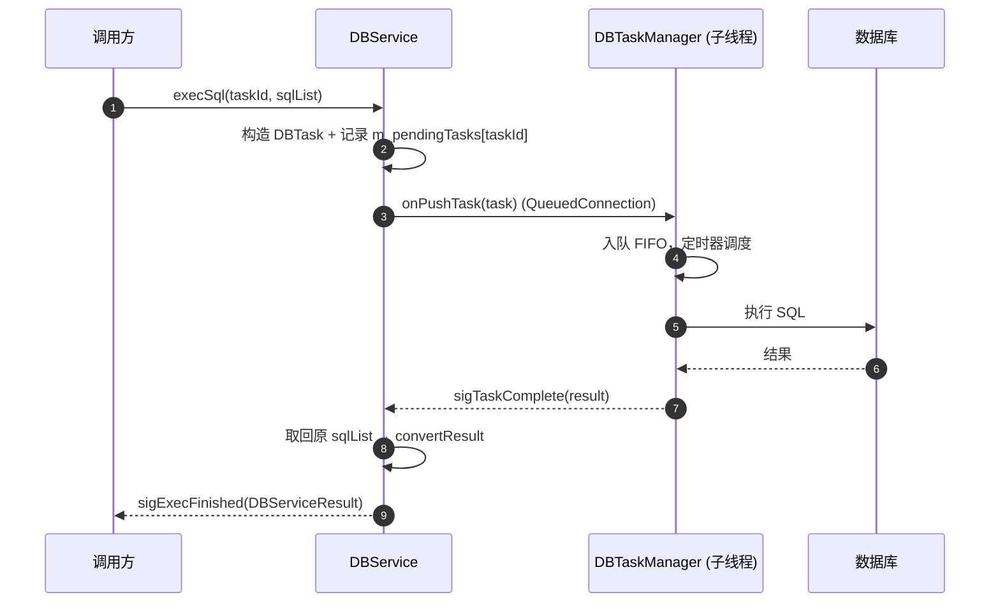
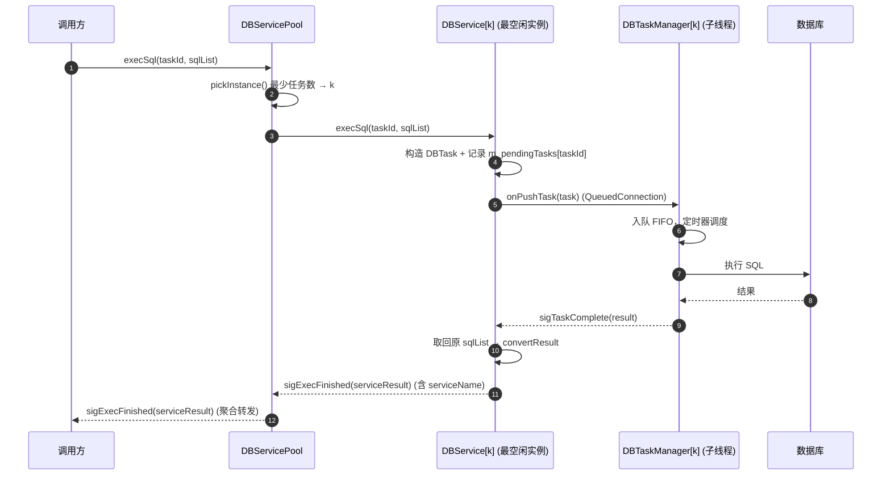

# DBServicePool 设计文档

> 状态：**已实现（v1.5.1）** | 日期：2026-08-03 | 版本：V1（不含平滑重启/差异化配置）
> 已确认决策：
> - poolSize=1 即单实例用法（Pool 默认值，保留扩容入口），调用方可视需要选择 DBService 或 DBServicePool；
> - 不支持实例级差异化配置——需要新配置时声明新的 Pool；
> - 信号聚合仅 `sigExecFinished`（DBService 当前无连接/错误信号）。

## 一、定位

在 DBService 之上增加一层**无状态调度壳**：持有 N 个 DBService 实例，负责"任务分发 + 信号聚合 + 配置克隆"。**不修改 DBService 内部执行逻辑**，调用方面对一个 Pool，使用体验等同单个 DBService。

### 解决的问题（多实例方案的调用方负担）

| 痛点 | 方案 |
|------|------|
| 调用方手动分发，负载不均 | Pool 自动负载均衡（最少任务数） |
| 多套信号连接 | Pool 聚合转发为统一信号 |
| 配置重复维护 | 配置模板自动克隆 |
| 并发扩展需改调用方代码 | 改 poolSize 一个参数 |

### 保留的优点（相对线程池）

- 多数据库支持（差异化配置扩展口）
- 实例级故障隔离
- 逐实例平滑升级（V2）
- DBService 内部零侵入（仅新增一个查询方法）

## 二、目录结构

```
DBService/src/DBServicePool/
├── DBServicePool.h      # 对外头文件（发布时拷入 include/）
└── DBServicePool.cpp
```

## 三、类设计

```cpp
class DBServicePool : public QObject
{
    Q_OBJECT
public:
    DBServicePool(const DBConfig& baseConfig, int poolSize,
                  DBServiceType type = DBServiceType::Standard,
                  QObject* parent = nullptr);
    ~DBServicePool();

    // 生命周期
    bool init();                 // 创建 poolSize 个 DBService（克隆配置 + 自动命名 + 连信号）
    void start();                // 逐实例 start()

    // 任务分发（主入口，重载与 DBService 对齐）
    void execSql(const QString& taskId, const QVector<SqlTuple>& sqlList);
    void execSql(const QString& taskId, const QString& tag, const QString& sql, bool isModify = false);

    // 定向分发（可选：跳过负载均衡，固定发往某实例）
    void execSqlOn(int instanceIndex, const QString& taskId, const QVector<SqlTuple>& sqlList);

    // 状态查询
    int  poolSize() const;
    int  pendingCount() const;          // 全池未完成任务数
    int  pendingCount(int index) const; // 单实例
    QStringList serviceNames() const;   // 如 {pool_0, pool_1, ...}

signals:
    void sigExecFinished(const DBServiceResult& result);               // 聚合转发
    void sigConnectionChanged(const QString& serviceName, bool connected); // 聚合
    void sigErrorLog(const QString& serviceName, const QString& errMsg);   // 聚合

private:
    int pickInstance();             // 负载均衡：最少任务数
    void initConnections(int idx);  // 转发 3 类信号

    DBConfig             m_baseConfig;
    int                  m_poolSize;
    DBServiceType        m_type;
    QVector<DBService*>  m_services;      // 实例（QObject 子对象，随 Pool 析构）
    int                  m_roundRobinIndex = 0;
};
```

## 四、负载均衡：最少任务数（Least Load）

```cpp
int DBServicePool::pickInstance()
{
    int best = 0;
    for (int i = 1; i < m_poolSize; ++i)
        if (m_services[i]->pendingCount() < m_services[best]->pendingCount())
            best = i;
    return best;
}
```

- 每次 `execSql` 动态选**当前排队最少**的实例（优于静态 round-robin）；
- 依赖 DBService 新增只读查询方法 `pendingCount()`（见第六节），反映真实队列深度（含被拒残留条目，P0-1 修复后更准）。

## 五、信号聚合

```cpp
// 信号到信号直连，任何实例完成自动转发（DBService 当前仅此一个结果信号）
connect(service, &DBService::sigExecFinished,
        this, &DBServicePool::sigExecFinished);
```

taskId 全局唯一（调用方生成），回调结果自带 serviceName 可溯源，**调用方无需知道任务发往哪个实例**。

## 五·1、时序对比：单实例 vs Pool

### 单实例模式（一个 DBService）



### Pool 模式（N 个 DBService）



### 关键差异

| 环节 | 单实例 | Pool | 差异本质 |
|------|--------|------|----------|
| 入口 | 调用方直接调 DBService | 调 Pool，一个对象对 N 实例 | 调用方永远只认识一个门面 |
| 分发决策 | 无，就一个实例 | `pickInstance()` 查各实例队列深度 | 新增的"决策点"集中在 Pool 一处 |
| 并发度 | 1 线程 1 连接 | N 线程 N 连接并行 | 短查询可并行处理，吞吐提升 |
| 结果回传 | DBService 直接 emit 给调用方 | 先回到 Pool，再聚合转发 | 调用方只连一套信号 |
| 结果溯源 | taskId 唯一 | taskId + serviceName | 不用知道任务发到哪个实例 |

区别只有三处：**入队前多一个"选实例"决策、回传时多一跳聚合、以及整体多路并行**。`DBService[k]` 内部处理链路与单实例完全一致，Pool 对内部零改动。

## 六、DBService 依赖改动（极小，向后兼容）

| 新增方法 | 用途 |
|----------|------|
| `int DBService::pendingCount() const;` | 返回 `m_pendingTasks.size()`，供负载均衡 |

只加一个查询方法，不改任何现有行为。V2 再补公开 `stop()` 支持平滑逐实例重启。

## 七、配置管理

- `baseConfig` 克隆：`DBConfig` 为值类型（QString 隐式共享），直接拷贝 `poolSize` 份；
- 实例命名：`serviceName = "pool_" + index`（如 `pool_0`），日志/回调可溯源；
- **差异化配置不做**：需要新配置（如多库）时直接声明新的 Pool，Pool 内实例保持同构。

## 八、调用方示例

```cpp
DBServicePool pool(cfg, 4);            // 4 路并发，等价于手动声明 4 个 DBService
connect(&pool, &DBServicePool::sigExecFinished, this, &MainWindow::onFinished);

pool.init();
pool.start();
pool.execSql(taskId, "hist", "SELECT * FROM histtest", false);   // 自动分发到最空闲实例
```

并发扩容：`DBServicePool(cfg, 8)`，调用方代码零改动。

## 九、边界情况

1. **多库需求**：V1 全池同库；多库/新配置直接声明新的 Pool（已确认决策，不做 setInstanceConfig）；
2. **P0-1 影响**：被拒任务残留令 `pendingCount()` 偏高（该实例被少分派）——方向安全（不会过载），随 P0-1 修复消失；
3. **线程模型**：每实例 `WorkerThread` 模式，池内天然 N 线程 N 连接，隔离性等同多实例；
4. **日志**：每实例各自 DBLogManager（与现状一致），serviceName 后缀区分。

## 十、版本规划

- **V1（v1.5.1，已实现）**：Pool 创建/分发/聚合 + DBService::pendingCount()；
- **V2**：DBService::stop() 平滑重启、实例健康检查与故障剔除。
